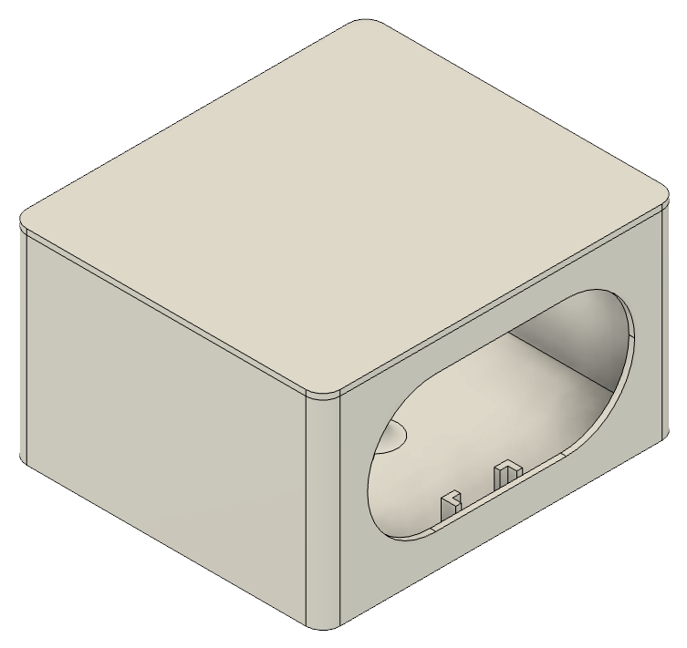
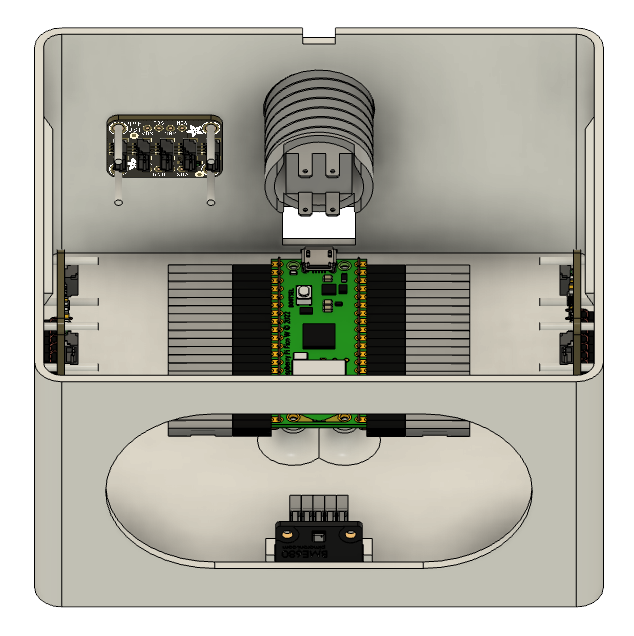

# AirQuality Enclosure

  

This folder contains 3D models and Fusion 360 design files for an IoT device enclosure. For your convenience, STL files are included so you can 3D print the enclosure yourself.

## Assembly

Assembly instructions:
1. Print all STL parts using your preferred 3D printer and material.
2. Refer to the render below to identify part names and positions.
3. Use M2 screws to secure microcontroller.
4. Slide other electronics into place.
5. Cover the front opening with metal wire mesh.

  

